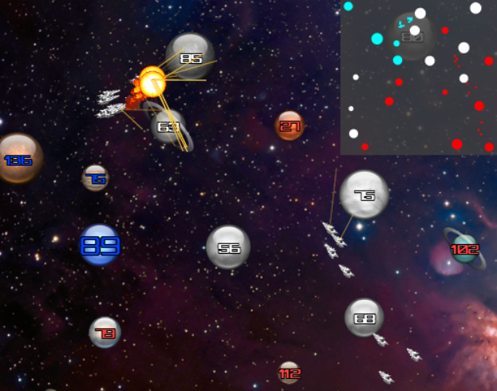

TheStarsMyDestination
=====================

Realtime Simulation Game

■銀河系を制覇せよ！■

＜遊び方＞
自分の惑星から艦隊を出撃させて、他の惑星を占領してください。
惑星の上にある数字は戦力です。
自分の惑星をクリックorタッチすると緑でポイントされますので、そのまま出撃させたい惑星までドラッグすると艦隊を出撃させる事が出来ます。
惑星をクリックorタッチしたまま数秒待つと、自分の惑星全てから選択した惑星へ艦隊が出撃します。
出撃時、艦隊出撃時に下の派兵レートに応じた戦力を消費します（消費戦力＝艦隊戦力）
自分の惑星から自分の惑星に出撃すると戦力が加算されます。
派兵レートは右下のスライダーバーで調整可能です。
プレイヤーまたはＣＰＵの総戦力が０になったらゲームオーバーとなります。

＜おまけ＞
ＣＰＵのアルゴリズムは単純に一番近い惑星の戦力差が一定以上になったら艦隊を派遣するという、かなり単純なアルゴリズムになってます。
なので、ＣＰＵ側と接する惑星を壁として奥の惑星から艦隊を送ると楽に攻略出来ます。

TODO list
惑星選択時のマップスクロール改善
マップの拡大縮小
戦闘演出
艦隊戦
ＣＰＵ思考ルーチン
